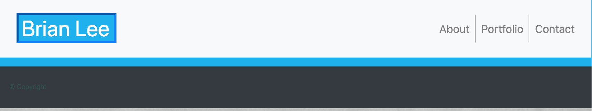
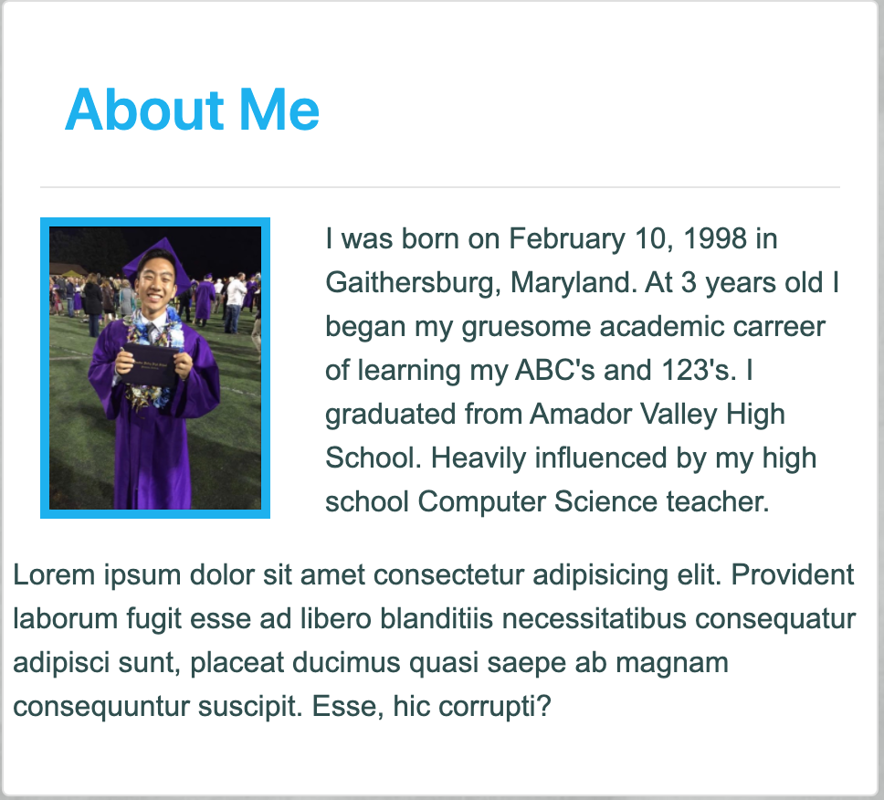
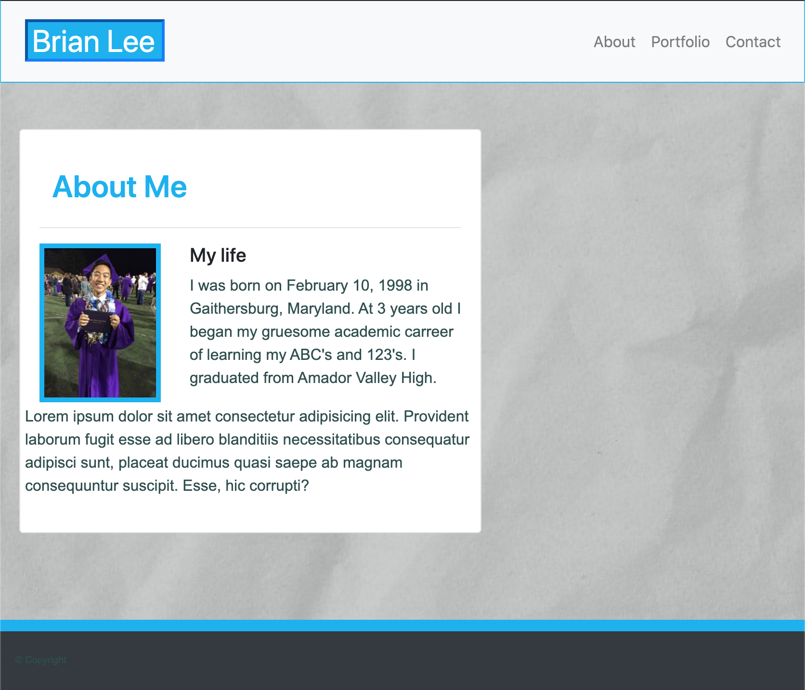
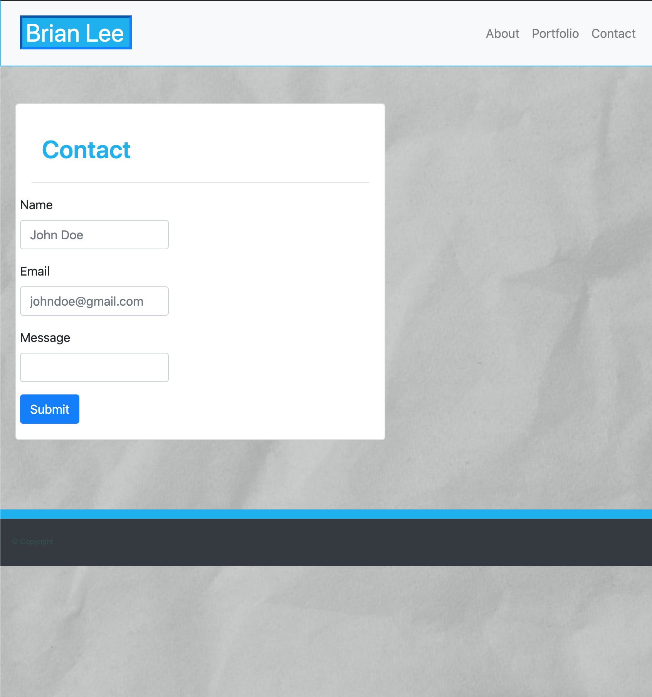
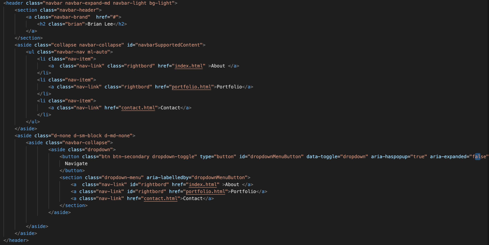

# Portfolio
## Table of contents
* [Prerequisites](https://github.com/brianjunhyuplee/portfolio#prerequisites)
* [Objective](https://github.com/brianjunhyuplee/portfolio#objective)
* [Operation](https://github.com/brianjunhyuplee/portfolio#operation)
* [Process](https://github.com/brianjunhyuplee/portfolio#process)
* [Built-With](https://github.com/brianjunhyuplee/portfolio#built-with)
* [Deployed-Link](https://github.com/brianjunhyuplee/portfolio#deployed-link)
* [Authors](https://github.com/brianjunhyuplee/portfolio#authors)
* [License](https://github.com/brianjunhyuplee/portfolio#license)
* [Acknowledgements](https://github.com/brianjunhyuplee/portfolioo#acknowledgments)
## Prerequisites:
* Computer with internet access
## Objective: 

Create a working website for my portfolio using BootStrap.

## Operation:

To use the design, simply click on the [deploymentlink](https://brianjunhyuplee.github.io/portfolio/).
Use the Navigation bar at the top of the browser to navigate to different parts of the website.

## Process:
**1.  Create Basic Template For ALL Webpages**

The Navbar and Footers were both defined features of BootStrap.

These two assets will remain constant between the 3 HTML files.
In addition to these, all three files will also implement a card.

**2.  Design Each Webpage**
1. For index.html

Create a card with title header "About Me".
Using rows and column you can format the image and the text in desired ways.
When applied correctly, it should give a similar effect to as shown below.

2. For portfolio.html

Create a card with title header "Portfolio".
Similar methods will be used as seen in index.
Instead of having text, the images will be placed next to eachother.
This is achieved by placing the items in the same row, but different columns.

3. For contact.html

Create a card with title header "Contact".
Using functions from "form" or more specifically "form-group" input lines will be added to the card.
The submit button was implemented using "button type="submit"".

**3.  Adjust code to media queries**

When changing to different devices such as a mobile device or tablet, formatting should be altered slightly to better suit that device.
Bootstrap has built-in breakpoints labeled as "lg", "md", and "sm".
At certain breakpoints, use "collapse" to remove code segment from the html.

The code segment shown below demonstates the use of media queries in the navbar.

## Built With:
* [HTML](https://developer.mozilla.org/en-US/docs/Web/HTML)
* [CSS](https://developer.mozilla.org/en-US/docs/Web/CSS)
* [BootStrap]([https://getbootstrap.com/])

## Deployed Link:
* [Brian's_Portfolio_Webpage](https://brianjunhyuplee.github.io/portfolio/)

## Author(s):
**Brian Lee**
* [GitHub](https://github.com/brianjunhyuplee)
* [LinkedIn](https://www.linkedin.com/in/brian-lee-559208187/)
* [MyPortfolio :)](https://brianjunhyuplee.github.io/portfolio/)

## License:

This project is licensed under the [MIT-License](https://www.mit.edu/~amini/LICENSE.md)

## Acknowledgments:
* Jerome Chenette (Lead Instructor of UCB Bootcamp)
* Kerwin Hy (TA at UCB Bootcamp)
* Manuel S Nunes (TA at UCB Bootcamp)
* Roger Le (Instructor at UCB Bootcamp)